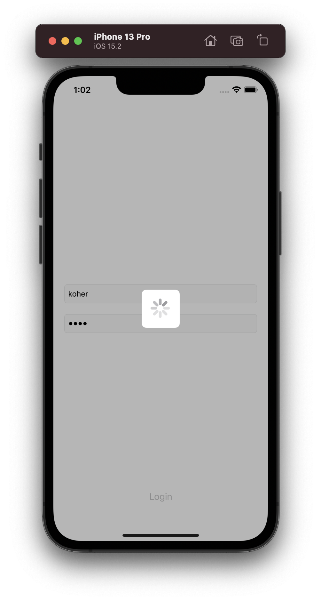
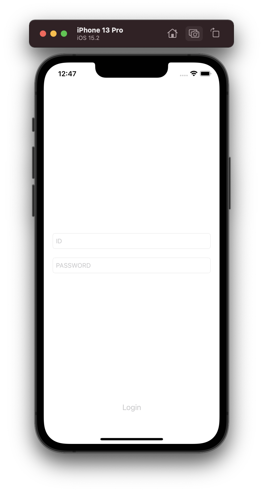
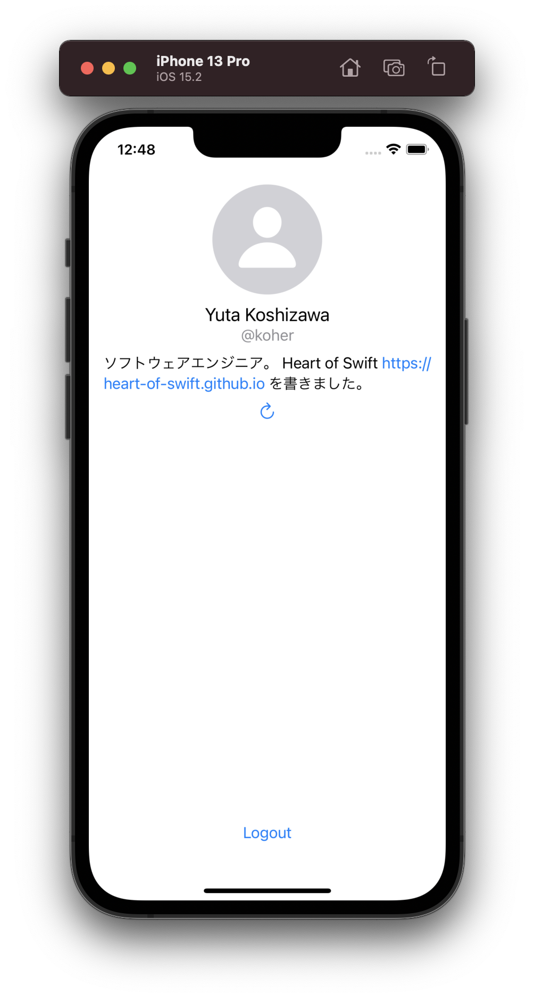
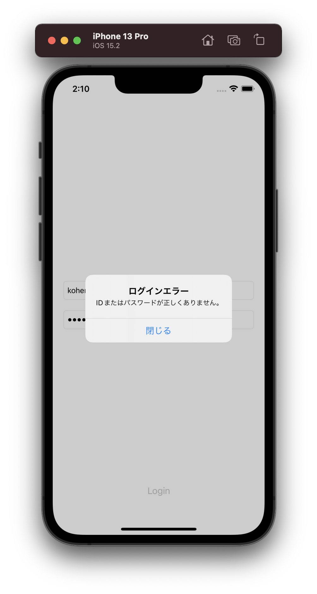

#  Login Challenge

"Login Challenge" は **iOS アプリのログイン画面を題材にコードをリファクタリングし、理想の設計の実現を目指す** チャレンジです。



本リポジトリには、 Fat View Controller (UIKit) / Fat View (SwiftUI) で実装された iOS アプリのプロジェクトが格納されています。このアプリの挙動を変えずに、理想の設計にコードを書き換えて下さい。元のコードにはテストが書かれていません。テストが書きやすい設計を実現し、テストを導入することも目指しましょう。

## 実行方法

Xcode 13.2 以降で LoginChallenge.xcworkspace （ xcodeproj でないことに注意❗）を開き、ビルド・実行して下さい。特別なセットアップは必要ありません。

## 仕様

本アプリは次の二つの画面からなります。

- ログイン画面
- ホーム画面

### ログイン画面



ログイン画面では ID とパスワードを入力し、ログインボタンを押すことでログイン処理が実行されます。ログインに成功するとホーム画面に遷移します。

ログインには、次の ID およびパスワードを利用して下さい。

| ID | パスワード |
|:--|:--|
| koher | 1234 |

その他にログイン画面が満たすべき仕様は次の通りです。

- ID とパスワードのいずれかが入力されていないときにはログインボタンを無効化する。
- ログイン処理中は ID およびパスワードの入力と、ログインボタンを無効化する。
- ログイン処理中は Activity Indicator を表示する。
    - `ActivityIndicatorViewController` が提供されており、これを `present` すれば良い。
- ログインに失敗した場合はアラートを表示する。
    - エラーにはログインエラー、ネットワークエラー、サーバーエラー、その他のエラーの 4 種類がある。種類に応じて適切なエラーメッセージを表示する。

### ホーム画面



ホーム画面はログインに成功したユーザーの情報を表示します。リロードボタンを押すとユーザー情報の再読み込みが、ログアウトボタンを押すとログアウト処理が実行されます。ログアウトが完了するとログイン画面に遷移します。

その他にホーム画面が満たすべき仕様は次の通りです。

- ユーザー情報のロード中はリロードボタンを無効化する。
- ロードに失敗した場合はアラートを表示する。
    - エラーには認証エラー、ネットワークエラー、サーバーエラー、その他のエラーの 4 種類がある。種類に応じて適切なエラーメッセージを表示する。
- ログアウト処理中は Activity Indicator を表示する。

## 構成

LoginChallenge.xcworkspace は次の三つからなります。

- `LoginChallenge`
- `Entities`
- `APIServices`

`Entities` と `APIServices` は Swift Package になっており、 `APIServices` が `Entities` に、 `LoginChallenge` は両方に依存します。

### `LoginChallenge`

アプリ本体です。本チャレンジの主な修正対象です。修正対象となるのは次の二つです。

- LoginViewController.swift
- HomeView.swift

LoginViewController.swift はログイン画面に、 HomeView.swift はホーム画面に相当します。前者は UIKit で、後者は SwiftUI で実装されているため、 UIKit で作られたアプリと SwiftUI で作られたアプリの両方のリファクタリングに取り組むことができます。どちらも Fat View (Controller) として実装されています。このままではコードの見通しが悪く、テストを導入するのも難しいため、理想の設計に作り変えましょう。

---

#### :bulb: メモ

SwiftUI に馴染みのない人向けに、 UIKit で実装された HomeViewController.swift も用意されています。 SwiftUI での開発が難しい方は `HomeViewController` のリファクタリングに取り組んで下さい。

`HomeViewController` を利用する場合は、 `LoginViewController` から `HomeViewController` に遷移させるために、 LoginViewController.swift 中の遷移に関するコードを次のように修正して下さい。

```diff
  // HomeView に遷移。
- let destination = UIHostingController(rootView: HomeView(dismiss: { [weak self] in
-     await self?.dismiss(animated: true)
- }))
- destination.modalPresentationStyle = .fullScreen
- destination.modalTransitionStyle = .flipHorizontal
- await present(destination, animated: true)
+ //let destination = UIHostingController(rootView: HomeView(dismiss: { [weak self] in
+ //    await self?.dismiss(animated: true)
+ //}))
+ //destination.modalPresentationStyle = .fullScreen
+ //destination.modalTransitionStyle = .flipHorizontal
+ //await present(destination, animated: true)

// HomeViewController に遷移。
- //performSegue(withIdentifier: "Login", sender: nil)
+ performSegue(withIdentifier: "Login", sender: nil)
```

なお、 `HomeViewController` は `HomeView` と比べると若干機能が足りませんが、リファクタリングの本質には影響ありません。足りない機能は次の二つです。

- ロード中のプレースホルダー表示
- URL タップ時に Web ページを Safari で表示

---

### `Entities`

アプリ内で利用する型を提供します。具体的には `User` 型と各種エラー型が提供されます。

#### `User`

ユーザー情報を表す型です。

```swift
struct User: Identifiable, Codable, Sendable {
    let id: ID
    var name: String
    var introduction: String
    
    struct ID: RawRepresentable, Hashable, Codable, Sendable
            ExpressibleByStringLiteral, CustomStringConvertible {
        let rawValue: String
    }
}
```

#### エラー型



次の 4 種類の型を提供します。

| 型 | 説明 |
|:--|:--|
| `AuthenticationError` | 認証エラー。未ログインやログイン後のトークン期限切れで発生する。 |
| `LoginError` | ログインエラー。ログイン時に ID またはパスワードが正しくない場合に発生する。 |
| `NetworkError` | ネットワークエラー。通信に問題が生じた場合に発生する。 |
| `ServerError` | サーバーエラー。サーバーサイドでエラーが生じた場合に発生する。 |

### `APIServices`

サーバーと通信して API を叩き、結果を取得します。サーバーとの通信は `APIServices` にラップされているため、本チャレンジの中でサーバーと通信するためのコードを書く必要はありません。 `APIServices` は次の二つの型を提供します。

- `AuthService`
- `UserService`

---

#### :bulb: メモ

これらの実装は API を叩いているふりをしているだけで、実際には通信をしていません。 1 / 2 の確率でランダムにエラーが発生するように実装されています。デバッグのために、必ず成功／失敗させたい場合には `APIServices` のコードを修正することで簡単に実現できます。たとえば、次のようにコードを修正することで必ず処理を成功させることができます。

```diff
- guard Bool.random() else {
+ guard true else {
      if Bool.random() {
          throw NetworkError(cause: GeneralError(message: "Timeout."))
      } else if Bool.random() {
          throw ServerError.internal(cause: GeneralError(message: "Rate limit exceeded."))
      } else {
          throw GeneralError(message: "System error.")
      }
  }
```

---

#### `AuthService`

`AuthService` はログインおよびログアウトのための API を提供します。

```swift
enum AuthService {
    static func logInWith(id: String, password: String) async throws
    static func logOut() async
}
```

なお、 `AuthService` が `enum` なのは、インスタンスを生成せず、 `AuthService.logOut()` のように `static` にメソッドを呼び出すことが想定されているためです。

また、 `logOut` メソッドに `throws` が付与されていないのは、 API を叩く過程でエラーが発生しても、ローカルのトークンを破棄してログアウトするからです（前述のように実際には通信しておらず、そういう体（てい）の設計です）。

#### `UserService`

`UserService` はユーザー情報を取得するための API を提供します。

```swift
enum UserService {
    // 現在ログイン中のユーザーの取得
    static func currentUser() async throws -> User
}
```

未ログインの状態、またはトークンが期限切れの状態で `UserService` のメソッドを呼び出すと `AuthenticationError` が `throw` されます。
